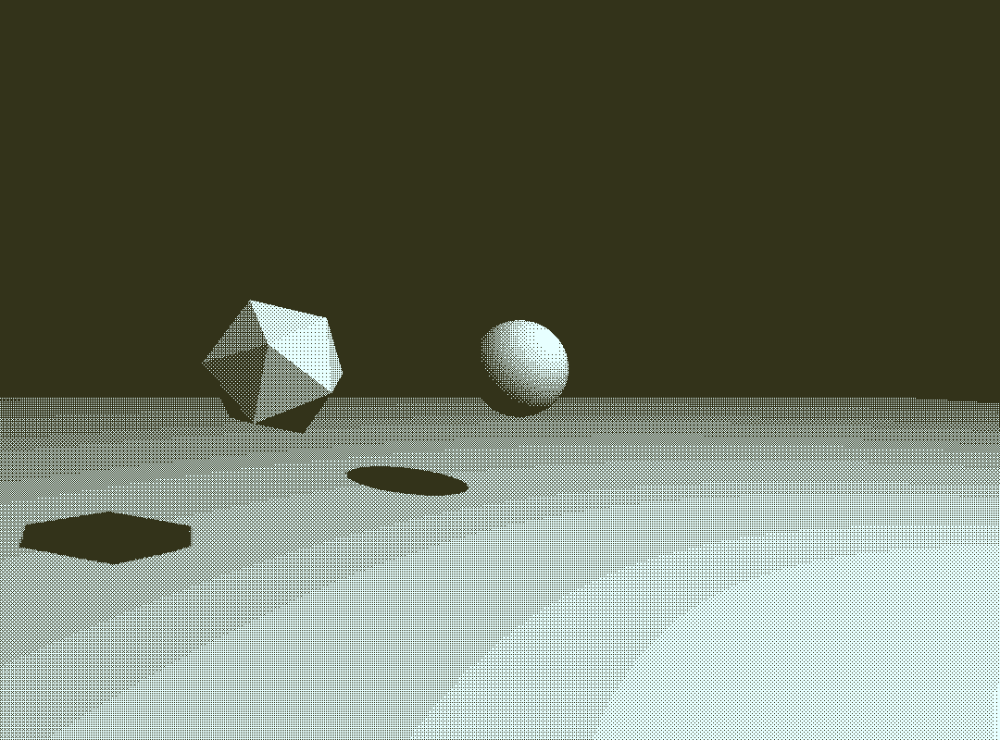
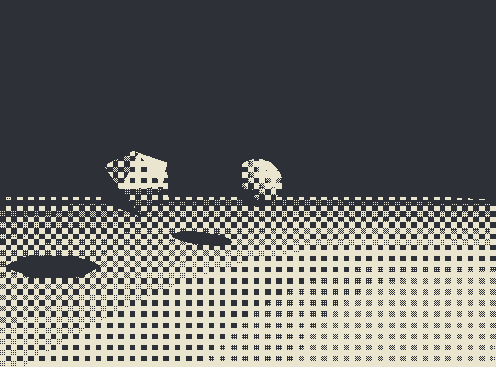
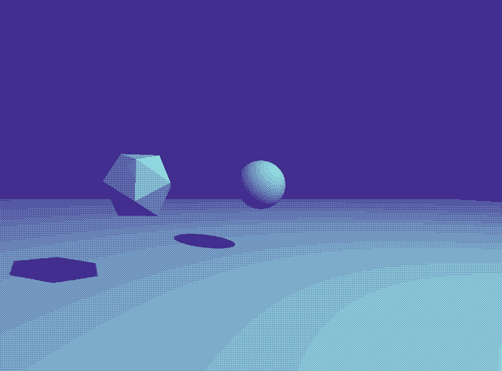
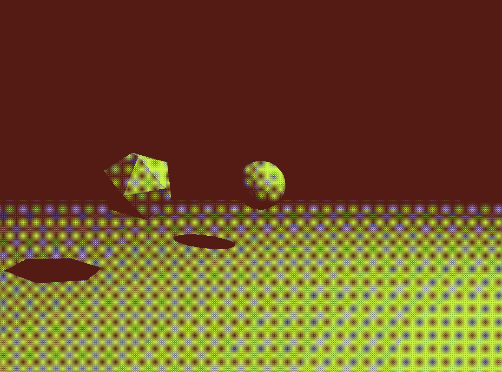

# dither post-processing in three.js

fragment shader converts to greyscale then applies 1bit or 2bit dithering using a bayer matrix

inspired by Lucas Pope's Return of the Obra Dinn

references used:  
https://en.wikipedia.org/wiki/Ordered_dithering  
http://alex-charlton.com/posts/Dithering_on_the_GPU/  

